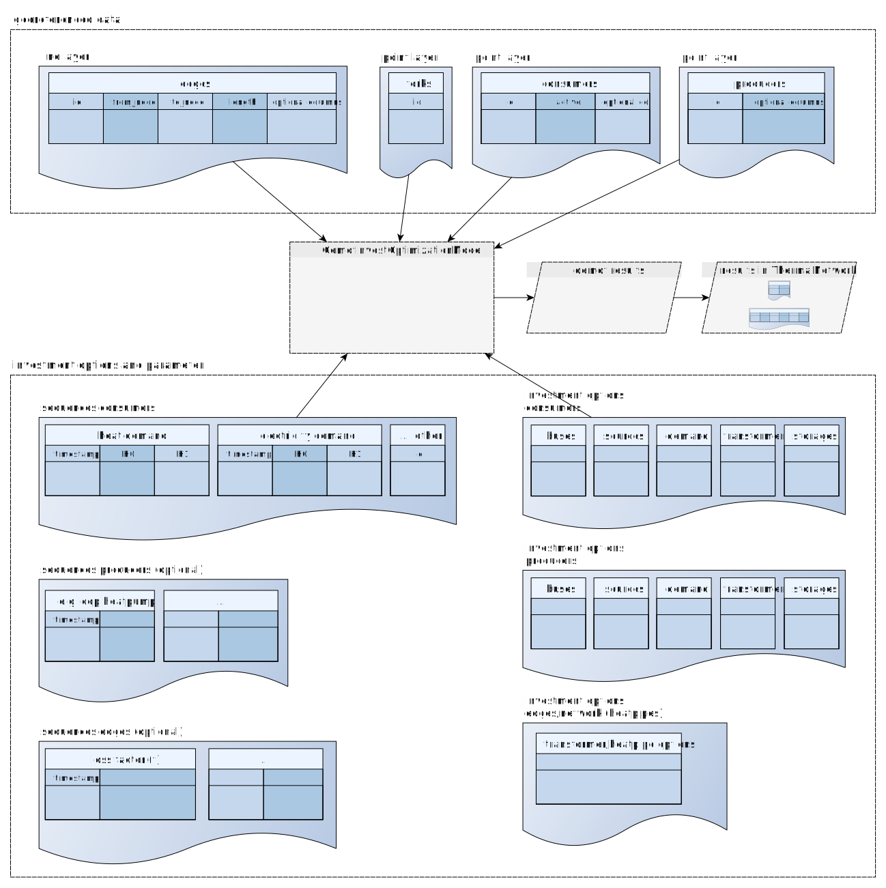

.. _optimization_models_label:

~~~~~~~~~~~~~~~~~~~
Optimization models
~~~~~~~~~~~~~~~~~~~

Generally, this library should allow the optimization of district heating grids
with various configurations settings and different approaches.
The optimization methods of this library are tools to assist the
planning process of DHS projects and to analyze the economic feasibility of DHS
for a given district, community or city - either by focusing on the DHS itself,
or by also considering the overall energy system of a district, which could not
just be the heating sector, but also the electricity, mobility sector or the
gas infrastructure.

At the moment, there is one approach using *oemof-solph* as linear optimisation library
implemented. This approach is explained in the following sections. It totally makes sense to have
some experiences with *oemof-solph* to understand this toolbox more easily.

Scope
-----

The following questions can be addressed using the `optimize_investment` method
of the *ThermalNetwork*:

* What is the cost-optimal topology and dimensioning of a DHS piping system?
  (Given the locations of potential central heat supply plants, the potential
  locations for the DHS piping system (e.g. street network),
  and the position of consumers)
* In addition to the first question, what is the cost-optimal expansion
  of a given DHS system.
* Is it cost-efficient to build a DHS at all, if there a consumer-wise heat
  supply alternatives? (Comparison of central and de-central supply strategies)
* What is the optimal dispatch of the heat producers? (Case, if there are no
  expansion options, but just existing DHS pipes)
* Planned: Streets-wise aggregation option

To answer these questions, at the moment,
the LP and MILP optimization library oemof.solph is used.
Other approaches, e.g. heuristic approaches, might follow.

The following sections will give an overview about the general usage/workflow,
(the necessary input data, the different optimization settings and options,
the results), and second, the underlying mathematical description.

Usage
-----

Links to the subsections:

* :ref:`Overview`
* :ref:`Input Data`
* :ref:`Optimization settings`
* :ref:`Results`

.. _Overview:

Overview
~~~~~~~~

The optimization of a given *ThermalNetwork* is executed by:

.. code-block:: python

    import dhnx

    tnw = dhnx.network.ThermalNetwork()
    tnw = network.from_csv_folder('path/to/thermal_network')

    invest_opt = dhnx.input_output.load_invest_options('path/to/invest_options')

    settgs = {
        'keyword1': value1,
        'keyword2': value2,
    }

    tnw.optimize_investment(settings=settgs, invest_options=invest_opt)

For executing an optimization, you must provide the optimization `settings`
and the `invest_options` additional to the previous data, which defines a
*ThermalNetwork*. Both are explained in the following section.

.. _Input Data:

Input Data
~~~~~~~~~~

In this section, it is firstly revised, what input data is exactly necessary
from the *ThemalNetwork* class, and then explained, what data needs to be
provided as `invest_options` and as `settings`.

The following figure provides an overview of the input data:

   Fig. 1: Optimization Input Data

The structure of the input data might look a bit confusing at the beginning, but provides a lot of
options for building up complex district heating models. There are two groups of data:
geo-referenced data and parameters for the investment optimisation (with might include other
oemof-solph related data). All data needs to be provided in csv files. This means the geo-referenced
data does not need to be geo-referenced for this model at all, but probably in many cases, it is the
export of four geo-referenced layers (e.g. geopandasdataframe, shp-file, or any other), which are
a line layer representing the potential places for the DHS-trenches, and three point layers for the
producers, the consumers, and the potential forks of the DHS system. All geometry information of
the network system is passed by an *id* for each element. Thus, the line layer connects all points
and provides the spatial relation with the attributes *from_node*, *to_node*, and *length*. If you
prepare the data, be careful that every consumer is connected to an edge/line, and every piping
network system is connected to at least one producer.

.. _TN_Input :

ThermalNetwork
""""""""""""""

The data for the *ThermalNetwork* must be provided in the structure as defined
for the .csv reader. The following data is required for applying an
optimization:

.. code-block:: txt

    tree
    ├── edges.csv                       # (required)
    ├── consumers.csv                   # (required)
    ├── forks.csv                       # (required)
    ├── producers.csv                   # (required)
    └── sequences                       # (optional)
        └── consumers-heat_flow.csv

The attributes, which are required, and which are optional with respect
to the optimization, are presented in detail in the following:

Edges
'''''

.. csv-table::
   :header-rows: 1
   :file: _static/opti_edges.csv

The following optional attributes must be given in every *ThermalNetwork*:

* **id**: see :ref:`Thermal Network <thermal_network_label>`
* **from_node**: see :ref:`Thermal Network <thermal_network_label>`
* **to_node**: see :ref:`Thermal Network <thermal_network_label>`
* **length**: see :ref:`Thermal Network <thermal_network_label>`

The following optional attributes are introduced by the optimization module:

* **existing**: Binary indicating an existing pipe. If there is no column
  *existing* given, all Edges are free for optimization.
* **capacity**: Capacity of existing pipes.
  If *existing* is *True*, a *capacity* must be given.
* **pipe_type**: Label of the type of pipe. The *pipe_type* refers to
  a set of parameters of a pipeline component. The parameters for the
  *pipe_type* must be given in the following table (see `pipe_options`).
  If *existing* is *True*, a *pipe_type* must be given.
* **active**: Binary indicating that this edge is considered. If no column
  *active* is given, all edges are active. With this attribute, single edges
  can be switched on and off. This can be very useful, if different scenarios
  should be analyzed, e.g. you might like to make a given street/edges unavailable.
* **add_fix_costs**: Additional fix investment costs. Depending on the street
  and route of a DHS, the construction costs might differ. With this parameter,
  additional fix investment costs (independent of the size of the pipes) can be
  considered for each edge individually. Therefore, you need to apply a
  nonconvex investment (see `pipe_options`). (*not implemented yet*)

Consumers
'''''''''

.. csv-table::
   :header-rows: 1
   :file: _static/opti_consumers.csv

The following optional attributes must be given in every *ThermalNetwork*:

* **id**: see :ref:`Thermal Network <thermal_network_label>`

The following optional attributes are introduced by the optimization module:

* **active**: Binary indicating that consumer-xy is considered. If no column
  *active* is given, all consumers are active. With this attribute, single
  consumers can be switched on and off (e.g. for scenario analysis with
  different connection quotes).
* **P_heat_max**: Maximum heat load of consumer. If no column
  *P_heat_max* is given, the maximum heat load is calculated from the heat
  demand series (see `consumers-heat_flow.csv`). Depending on the optimization
  setting, *P_heat_max* or the demand series is used for the optimization (see
  :ref:`Optimization settings` for further information).

Producers
'''''''''

.. csv-table::
   :header-rows: 1
   :file: _static/opti_producers.csv

The following optional attributes must be given in every *ThermalNetwork*:

* **id**: see :ref:`Thermal Network <thermal_network_label>`

The following optional attributes are introduced by the optimization module:

* **active**: Binary indicating that producer is active. If no column
  *active* is given, all producers are active. With this attribute, single
  producers can be switched on and off (e.g. for scenario analysis for
  different supply plant positions.

Forks
''''''

.. csv-table::
   :header-rows: 1
   :file: _static/opti_forks.csv

The following optional attributes must be given in every *ThermalNetwork*:

* **id**: see :ref:`Thermal Network <thermal_network_label>`

For Forks, no additional required or optional attributes are added by the
optimization module.

Consumers-heat_flow
'''''''''''''''''''

Providing consumers heat flow time series is optional, **but** either the
consumers demand must be given in form of *P_heat_max* as attribute of the
`consumers`, or in form of a heat_flow time series with the minimum length of
1.

The following table shows an example of a `consumers-heat_flow`:

.. csv-table::
   :header-rows: 1
   :file: _static/opti_consumers-heat_flow_example.csv

The column index must be the consumers `id`.

Investment and additional options
"""""""""""""""""""""""""""""""""

If you want to do an investment or an simple unit commitment optimisation using
the `optimize_investment()` method of the *ThermalNetwork*, you need to provide
some additional data providing the investment parameter.
The following sheme illustrates the structure of the investment input data:

.. code-block:: txt

    tree
    ├── network
    |   └── pipes.csv           # (required)
    |
    ├── consumers
    |   ├── bus.csv             # (required)
    |   ├── demand.csv          # (required)
    |   ├── source.csv          # (optional)
    |   ├── storages.csv        # (optional)
    |   └── transformer.csv     # (optional)
    |
    └── producers
        ├── bus.csv             # (required)
        ├── demand.csv          # (optional)
        ├── source.csv          # (required)
        ├── storages.csv        # (optional)
        └── transformer.csv     # (optional)

The investment input data provides mainly all remaining parameters of the oemof
solph components, which are not specific for a single edges, producer or
consumer.

The minimum of required data is a specification of the pipe parameters (costs, and losses), a (heat)
bus and a heat demand at the consumers, and a (heat) bus and a heat source at the producers. The
detailed attributes are described in the following sections.

network/pipes.csv
''''''''''''''''''

You need to provide data on the investment options for the piping system. The following table shows
the minimal required data you need to provide:

.. csv-table::
   :header-rows: 1
   :file: _static/opti_pipes.csv

Each row represents an investment option. Note this investment option creates an oemof-solph
*Heatpipeline* component for each active edge. The units are given es examples. There are no units
implemented, everybody needs to care about consistent units in his own model. At the same time,
everybody is free to choose his own units (energy, mass flow, etc.).

* **label_3**: Label of the third tag. See :ref:`Label system <Label system>`.
* **active**: (0/1). If *active* is 0, this heatpipeline component is not considered. This attribute helps
  for easy selecting and deselecting different investment options.
* **nonconvex**: (0/1). Choose whether a convex or a nonconvex investment should be performed. This leads
  to a different meaning of the minimum heat transport capacity (*cap_min*). See
  *P_heat_max* is given, the maximum heat load is calculated from the heat
  demand series (see `consumers-heat_flow.csv`). Depending on the optimization
  setting, *P_heat_max* or the demand series is used for the optimization
  (see `oemof-solph documentation <https://oemof-solph.readthedocs.io/en/latest/usage.html#using-the-investment-mode>`_
  for further information).
* **annuity**: (0/1). Uses the annualized costs as investment costs. A pre-calculation for the
  *capex_pipes* and *fix_costs* is performed using *n_pipes* as the investment period. The annual
  interest rate is defined in the global settings
  (see :ref:`optimization settings <Optimization settings>`).
* **l_factor**: Relative thermal loss per length unit (e.g. [kW_loss/(m*kW_installed)].
  Defines the loss factor depending on the installed heat transport capacity of the
  pipe. The *l_factor* is multiplied by the invested capacity in investment case, and by the given
  *capacity* for a specific edge in case of existing DHS pipes.
* **l_factor_fix**: Absolute thermal loss per length unit (e.g. [kW/m]).
  In case of *nonconvex* is 1, the *l_factor_fix* is zero if no investement in a specific pipe
  element is done. Be careful, if *nonconvex* is 0, this creates a fixed thermal loss.
* **cap_max**: Maximum installable capacity (e.g. [kW]).
* **cap_min**: Minimum installable capacity (e.g. [kW]). Note that there is a difference if a
  *nonconvex* investment is applied (see `oemof-solph documentation <https://oemof-solph.readthedocs.io/en/latest/usage.html#using-the-investment-mode>`_
  for further information).
* **capex_pipes**: Variable investment costs depending on the installed heat transport capacity
  (e.g. [€/kW]).
* **fix_costs**: Fix investment costs independent of the installed capacity (e.g. [€])
* **n_pipes**: Investment period for the the annualized costs (e.g. [a]).

See the *Heatpipeline* API for further details about the attributes.

.. _Consumer invest data:

consumers/.
'''''''''''

All data for initialising *oemof-solph* components at the consumers are provided by the .csv files
of the consumers folder. For a principal understanding, check out the excel reader example of
*oemof-solph*, which works the same way:
`oemof-solph excel reader example <https://github.com/oemof/oemof-examples/tree/master/oemof_examples/oemof.solph/v0.4.x/excel_reader>`_.

The minimum requirement for doing an DHS optimisation is to provide an demand at the consumers.
Therefore, you need the following two .csv files: *bus.csv* specifies the
*oemof-solph* *Bus* components, and *demand.csv* defines the *oemof.solph.Sink*.

.. csv-table:: bus.csv
   :header-rows: 1
   :file: _static/opti_consumer_bus.csv

You must provide at least one bus, which has a label
(*label_2*, see :ref:`Label system <Label system>`), and needs to be *active*. Optionally, you can
add an *excess* or a *shortage* with *shortage costs* or *excess costs* respectively. This might
help to get an feasible optimisation problem, in case your solver says, 'infeasible', for finding
the error.

.. csv-table:: demand.csv
   :header-rows: 1
   :file: _static/opti_consumer_demand.csv

The demand also needs to have a label (*label_2*, see :ref:`Label system <Label system>`), has the
option for deactivating certain demands by using the attribute *active*, and needs to have a
specification for the *nominal_value*. The *nominal_value* scales your demand.

producers/.
'''''''''''

The producers look quite similar as the consumers. The consumers are taking energy from the
DHS system. That means, the energy need to be supplied somewhere, which makes some kind of source
necessary. To connect a source in the oemof logic, there needs to be a *oemof.solph.Bus* to which
the source is connected. The two files *bus.csv* and *source.csv* need to be provided:

.. csv-table:: bus.csv
   :header-rows: 1
   :file: _static/opti_consumer_bus.csv

The *bus.csv* table works analog to the consumers (see :ref:`consumers/. <Consumer invest data>`).

.. csv-table:: source.csv
   :header-rows: 1
   :file: _static/opti_producer_source.csv

You need to provide at least one source at the *source.csv* table. Additionally, there are already a
couple of options for adding additional attributes of the *oemof.solph.FLow* to the source, e.g.
*variable_costs*, *fix* feed-in series, and *min* and *max* restrictions.

Generally, with this structure at every producer and consumer multiple oemof components, like
*transformer* and *storages* can be already added.

.. _Label system:

Label systematic
~~~~~~~~~~~~~~~~

In order to access the oemof-solph optimisation results, a label systematic containing a tuple
with 4 items is used. Please check the basic example of oemof-solph for using tuple as label
(`oemof-solph example tuple as label <https://github.com/oemof/oemof-examples/blob/master/oemof_examples/oemof.solph/v0.4.x/basic_example/basic_example_tuple_as_label.py>`_).

The following table illustrates the systematic:

.. csv-table:: Labelling system (bold: obligatory; italic: examples)
   :header-rows: 1
   :file: _static/opti_label_sys.csv

The labels are partly given automatically by the oemof-solph model builder:

* **tag1: general classification**: This tag is given automatically depending on the spatial
  belonging. *Tag1* can be either *consumers* (consumer point layer), *producers*
  (producer point layer) or *infrastructure* (edges and forks layer).
  See :ref:`Thermal Network <TN_Input>`.
* **tag2: commodity**: This tag specifies the commodity, e.g. all buses and transformer
  (heatpipelines) of the DHS pipeline system have automatically the *heat* as *tag2*. For a
  transformer of the consumers or the producers the *tag2* is *None*, because a transformer usually
  connects two commodities, e.g. gas --> heat.
* **tag3: specification / oemof object**: The third tag indicates either the oemof object and is
  generated automatically (this is the case for *demand.csv*, *source.csv* and *bus.csv*),
  or is the specific *label_3* of the *pipes.csv*, *transformer.csv* or *storages.csv*.
* **tag4: id**: The last tag shows the specific spatial position and is generated automatically.

.. _Optimization settings:

Optimization settings
~~~~~~~~~~~~~~~~~~~~~

The following table shows all options for the optimisation settings:

.. csv-table::
   :header-rows: 1
   :file: _static/opti_settings.csv

Some more explanation:

* **heat_demand**: If you set *heat_demand* to `'scalar'`, *num_ts* is automatically 1. If you
  want to use the time series, simple type anything else `'scalar'`.

.. _Results:

Results
~~~~~~~

For checking and analysing the results you can either select to write the investment results of the
heatpipeline components in the Thermalnetwork. You will find the results there:

.. code-block:: python

    # edges-specific investment results (if you select settings['get_invest_results'] = True)
    results = network.results.optimization['components']['edges']

    # oemof-solph results "main"
    r_oemof_main = network.results.optimization['oemof']

    # oemof-solph results "meta"
    r_oemof_meta = network.results.optimization['oemof_meta']

Or you can also dump the oemof results and analyze the results as described in
`oemof-solph handling results <https://oemof-solph.readthedocs.io/en/latest/usage.html#handling-results>`_.
The labelling systematic will help you to easily get want you want,
check :ref:`Label system <Label system>`.

Introducing example
-------------------

Text.

